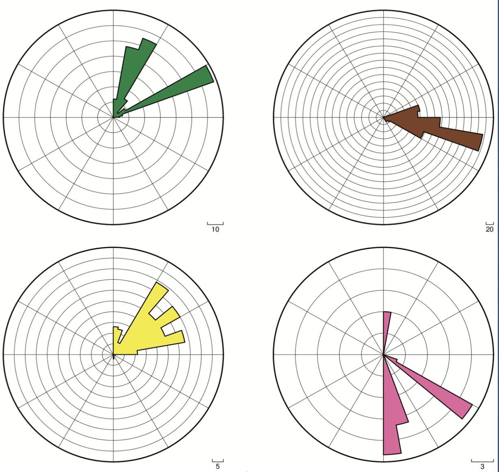

# roses_and_maps
A program to create rose diagrams and maps using PyGMT, for mega-scale glacial lineation interpretation.

The current functionality is that it is able to read in real data and produce a rose diagram as a .pdf.
Coming soon: Associated maps showing the position of mega-scale glacial lineations.

Task 1:

I plan to organize this script with one class called LineationDataset (the chunk of data I want to work on). This makes better organizational sense when I want to filter by a bounding box, maybe add a function that allows me to get the mean orientation, etc.

Task 2:

I use input() as a parameter input system. I will also plan to add tests, like assert statements, within my code.

## installation instructions:

install PyGMT and it's associated dependencies to your conda/mamba environment.
    for example:
    
    micromamba activate GEOS694
    micromamba install PyGMT

download toydata2.csv or toydata.csv locally. Provide the filepath when prompted.
